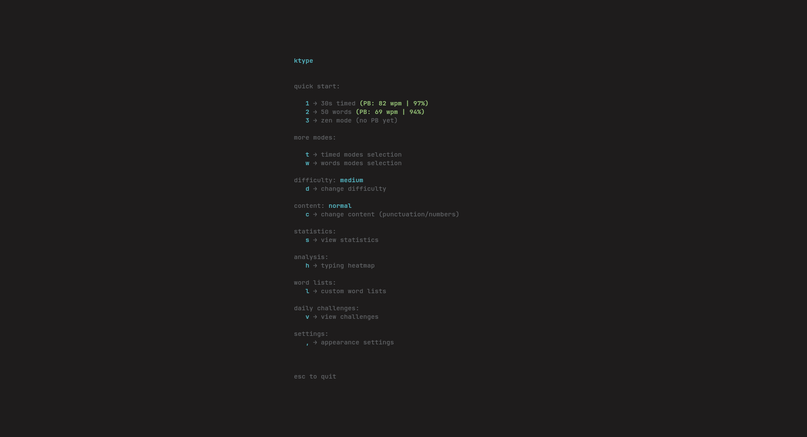
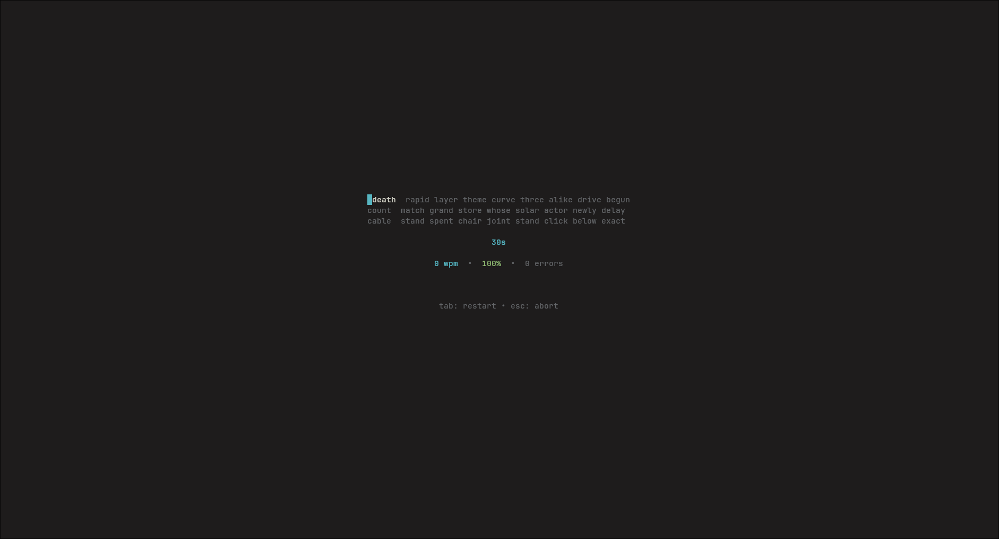

# ktype

A fast, minimal CLI typing test application with a clean MonkeyType-inspired interface. Built with Go and Bubble Tea.

<p align="center">
  
  <br/>
  
</p>

## Features

- **Multiple Game Modes**
  - Timed: 15, 30, 60 seconds (or custom duration)
  - Words: 10, 25, 50, 100 words (or custom count)
  - Zen: Unlimited typing session

- **Difficulty Levels**
  - Easy: Common short words
  - Medium: Mixed vocabulary
  - Hard: Complex longer words

- **Word Complexity**
  - Normal: Letters only
  - Punctuation: Includes punctuation marks
  - Numbers: Includes numbers
  - Full: Everything combined

- **Personal Bests & Leaderboard**
  - Automatically tracks your best scores per mode
  - Stores up to 100 recent attempts
  - PB notifications when you beat your record

- **Statistics Dashboard**
  - WPM trends over time
  - Accuracy tracking
  - Average WPM by mode
  - Personal bests overview

- **Typing Heatmap**
  - Visual representation of key frequency
  - Error tracking per key
  - Real-time heatmap updates

- **Daily Challenges**
  - 3 new challenges every day
  - Speed, accuracy, and volume targets
  - Progress tracking and completion badges

- **Custom Word Lists**
  - Create and manage custom word lists
  - Use your own vocabulary for practice

- **Customization**
  - 6 cursor styles (block, line, bar, underscore, beam, underline)
  - 10 accent colors + custom hex colors
  - Configurable heatmap display

## Installation

### From Source

```bash
git clone https://github.com/code-grafiki/ktype.git
cd ktype
go build -o ktype .
./ktype
```

### Prerequisites

- Go 1.23 or later
- Terminal with Unicode support (for best experience)

## Usage

Launch ktype and use the menu to select your game mode:

```bash
./ktype
```

### Quick Start Keys

- `1` - Quick start 30 seconds
- `2` - Quick start 50 words
- `3` - Zen mode (unlimited)
- `t` - Select time mode
- `w` - Select words mode
- `d` - Change difficulty
- `c` - Change word complexity
- `s` - View statistics
- `h` - View typing heatmap
- `l` - Manage custom word lists
- `v` - Daily challenges
- `,` - Settings

### During a Test

- Type the displayed words
- Use `Backspace` to correct mistakes
- Press `Space` to move to the next word
- Press `Tab` to restart
- Press `Esc` twice to quit

### After a Test

- `Tab` or `Enter` - Return to menu
- `Esc` twice - Exit application

## Configuration

Configuration is stored in `~/.config/ktype/config.json`:

```json
{
  "cursor_type": 1,
  "accent_color": "#5eacd3",
  "accent_color_enum": 5,
  "custom_color": "",
  "show_heatmap": true,
  "sound_enabled": false
}
```

## Data Storage

All data is stored locally in `~/.config/ktype/`:

- `config.json` - User preferences
- `scores.json` - Test history and personal bests
- `challenges.json` - Daily challenge progress
- `wordlists/` - Custom word lists

## Keyboard Shortcuts Reference

| Key | Action |
|-----|--------|
| `Ctrl+C` | Force quit (any screen) |
| `Esc` | Back / Quit prompt |
| `Esc` `Esc` | Confirm quit |
| `Tab` | Restart test / Back to menu |
| `Backspace` | Delete last character |
| `Space` | Submit word |

## Development

### Build Commands

```bash
# Build the application
go build -o ktype ./cmd/ktype

# Run the application
go run ./cmd/ktype

# Build for release (with optimizations)
go build -ldflags "-s -w" -o ktype ./cmd/ktype
```

### Testing

```bash
# Run all tests
go test ./...

# Run tests with coverage
go test -cover ./...

# Run specific test
go test -run TestFunctionName ./...
```

### Code Quality

```bash
# Format code
go fmt ./...

# Vet code
go vet ./...

# Tidy dependencies
go mod tidy
```

## Project Structure

```
ktype/
├── cmd/ktype/
│   └── main.go              # Application entry point
├── internal/
│   ├── app/
│   │   ├── model.go         # Bubble Tea model
│   │   ├── update.go        # Event handlers
│   │   ├── view.go          # View rendering
│   │   └── commands.go      # Timer commands
│   ├── game/
│   │   ├── types.go         # Game types and constants
│   │   ├── game.go          # Game logic
│   │   └── game_test.go
│   ├── storage/
│   │   ├── leaderboard.go   # Score persistence
│   │   ├── config.go        # Configuration
│   │   ├── heatmap.go       # Typing heatmap
│   │   ├── challenges.go    # Daily challenges
│   │   ├── statistics.go    # Statistics tracking
│   │   ├── wordlist.go      # Custom word lists
│   │   └── *_test.go
│   ├── ui/
│   │   ├── styles.go        # Lipgloss styles
│   │   ├── menu.go          # Menu screens
│   │   ├── game.go          # Game screen
│   │   └── stats.go         # Stats/challenges screens
│   └── words/
│       ├── types.go         # Difficulty/complexity types
│       ├── lists.go         # Word lists
│       ├── generator.go     # Word generation
│       └── *_test.go
├── go.mod
├── go.sum
└── README.md
```

## Dependencies

- [Bubble Tea](https://github.com/charmbracelet/bubbletea) - TUI framework
- [Lipgloss](https://github.com/charmbracelet/lipgloss) - Styling library
- [Colorprofile](https://github.com/charmbracelet/colorprofile) - Color support

## License

MIT License - see [LICENSE](LICENSE) file for details

## Contributing

Contributions are welcome! Please ensure:

1. Code follows `gofmt` formatting
2. Tests pass: `go test ./...`
3. No vet warnings: `go vet ./...`
4. Commits are descriptive and in imperative mood

## Acknowledgments

Inspired by [MonkeyType](https://monkeytype.com/) - the best web-based typing test.
